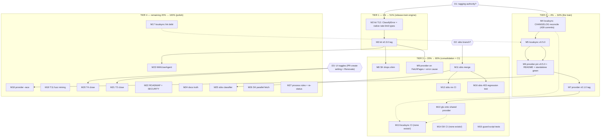

# Pareto Plan — go-github-kit Ecosystem: Release Train & Consolidation

**Date:** 2026-09-05 17:26 CEST
**Source inventory:** kit `TODO_LIST.md` (T2, T4, T11, T12) · go-localsync `TODO_LIST.md`
(provider-release block, pre-existing items) · status report
`docs/status/2026-09-05_16-39_ecosystem-migration-brutal-status.md` §f (50 items) ·
session findings after the push round (SK & go-localsync have **no CI at all**; sbts CI
only triggers on `main`/`develop`).

## Context (what the ecosystem looks like right now)

The extraction (Stream G) is code-complete: go-github-kit v0.2.0 is released, four
consumers are on it (Standup-Killer, github-local-sync, sbts, and the new
`go-localsync/provider/github` module), and origin CI on the kit is green. What remains
is a **release train**, **three consolidations**, **CI gaps**, and **polish**. Three
user decisions gate roughly half the remaining value:

- **D1 — Tagging authority:** may the agent cut releases (kit v0.3.0, localsync v0.5.0,
  provider v0.1.0) via the go-release lifecycle including pushing tags?
- **D2 — sbts branch strategy:** merge `m5-adapters` → `main` via PR, or keep stacking?
- **D3 — Two UI toggles:** repo setting "Allow GitHub Actions to create and approve
  pull requests" (unblocks T4's flake-lock PR; branch is already pushed) and the
  Renovate app install (T2).

## Pareto Breakdown

### The 1% that delivers 51%

**D1 + kit T12 + kit v0.3.0 tag (~110 min of actual work).**
One decision and one small library change collapse the ecosystem's biggest wart:
`ClassifyError` not recognizing `*gh.RateLimitError`/`*gh.AbuseRateLimitError`. Today
the same workaround shim lives in Standup-Killer AND the provider module. Shipping
v0.3.0 makes both deletable, enriches every consumer's error handling, and starts the
release train that everything downstream (provider standalone build, gls migration,
pkg.go.dev visibility) keys off.

### The 4% that delivers 64%

**The rest of the release train (~3h):** reconcile go-localsync's CHANGELOG across 439
unreleased commits → tag v0.5.0 → bump the provider module's parent pin (today it
**cannot build standalone**) → write its README → tag provider v0.1.0. Plus D2 (sbts
merge decision). This converts "code exists" into "shippable, consumable modules".

### The 20% that delivers 80%

**Consolidation + CI hardening:** migrate github-local-sync onto the shared provider
(kills the deliberate split brain), drop SK's shim, dedupe provider FetchAll onto
`githubkit.FetchPages`, and close the CI blind spots (sbts CI never runs nix — that is
exactly why its flake check rotted silently; SK and go-localsync have **no CI at all**).

### The other 20% → 100%

Lint debt (localsync pkg/cqrs: nestif + 2× SA1019), `-race` for ported provider tests,
fuzz corpus mining (T11), T4/T2 closure (toggle + observe), ROADMAP/SECURITY/CODEOWNERS
verification, `WithUserAgent` option, docs-truth pass, sbts classifier consolidation,
SK parallel file fetches, process rules into memory, final re-status.

---

## Medium Plan — ALL TODOs, 30–100 min each (27 tasks)

Sorted by impact → effort. Tier: T1=the 1%, T2=the 4%, T3=the 20%, T4=rest.

| # | Task | Repo | Tier | Impact | Effort | Depends |
|---|------|------|------|--------|--------|---------|
| M1 | Decision gates D1/D2/D3 recorded (tagging authority, sbts branch, UI toggles) | user+kit | T1 | 5 | 10min | — |
| M2 | Kit T12: `ClassifyError` recognizes `*gh.RateLimitError` + `*gh.AbuseRateLimitError` → `ErrRateLimited`, with table tests | kit | T1 | 5 | 75min | M1 |
| M3 | Kit v0.3.0 release: CHANGELOG, full gates, annotated tag, push, proxy verify | kit | T1 | 5 | 30min | M2 |
| M4 | go-localsync CHANGELOG reconciliation v0.4.2..HEAD (439 commits → honest [0.5.0] section) | localsync | T2 | 5 | 100min | M1 |
| M5 | go-localsync v0.5.0 release: gates (build/test/lint/flake check), tag, push, proxy verify | localsync | T2 | 5 | 30min | M4 |
| M6 | Provider module: bump parent pin to v0.5.0, `go mod tidy`, prove `GOWORK=off go build` green, write README | localsync | T2 | 5 | 40min | M5 |
| M7 | Provider v0.1.0 tag + push + pkg.go.dev/deps.dev visibility check | localsync | T2 | 4 | 20min | M6 |
| M8 | Standup-Killer: drop local `classify()` shim → kit v0.3.0, full gates | SK | T3 | 4 | 30min | M3 |
| M9 | Provider: rebuild `FetchAll` on `githubkit.FetchPages` + preserve original error cause in `wrapGitHubError` | localsync | T3 | 4 | 60min | M3 |
| M10 | github-local-sync: migrate `internal/github` onto shared provider module (delete duplication) | gls | T3 | 4 | 100min | M7 |
| M11 | sbts: land `m5-adapters` → `main` (PR or merge per D2), watch CI green | sbts | T3 | 4 | 45min | M1(D2) |
| M12 | sbts CI: add `nix build` + `nix flake check` jobs (root cause of silent rot) | sbts | T3 | 4 | 45min | M11 |
| M13 | go-localsync: add CI workflow (none exists!) — build, test with `-tags=goexperiment.jsonv2`, lint, flake check | localsync | T3 | 4 | 60min | — |
| M14 | Standup-Killer: add CI workflow (none exists!) — build, test, vet | SK | T3 | 3 | 60min | — |
| M15 | Kit: automated tests for `scripts/check-vendor-hash.sh` (toolchain-only pass, real drift fail, hash-rotate note) | kit | T3 | 3 | 45min | — |
| M16 | sbts: regression test — 403 WITHOUT rate headers now classifies Forbidden (behavior change, fixture-only today) | sbts | T3 | 3 | 30min | M11 |
| M17 | go-localsync lint debt: pkg/cqrs nestif + 2× SA1019 `Execute` → `ExecuteRef` (pre-existing) | localsync | T4 | 3 | 45min | — |
| M18 | Provider: `go test -race ./provider/github/...` run + fix findings (ported tests never raced) | localsync | T4 | 3 | 30min | M6 |
| M19 | Kit T11: mine nightly fuzz artifacts → seed corpus | kit | T4 | 2 | 30min | — |
| M20 | Kit T4 close: user toggles PR-creation setting → re-dispatch workflow → observe PR + PR-CI green | kit | T4 | 2 | 10min | M1(D3) |
| M21 | Kit T2 close: user installs Renovate → verify first renovate branch appears | kit | T4 | 2 | 10min | M1(D3) |
| M22 | Kit ROADMAP refresh (post-extraction era) + verify SECURITY.md/CODEOWNERS exist | kit | T4 | 2 | 30min | — |
| M23 | Kit `WithUserAgent` option (SK mutates `kernel.UserAgent` today) + test + v0.4.0 or fold into v0.3.0 | kit | T4 | 2 | 30min | M2 |
| M24 | Docs-truth pass: localsync TODO header ("Lint: 0" is false, stale date) + localsync AGENTS (provider, go.work) + SK TODO/FEATURES | 3 repos | T4 | 2 | 30min | — |
| M25 | sbts: consolidate `adaptKitStatusError` + `NewAPIError` status switch into one classifier | sbts | T4 | 2 | 45min | M11 |
| M26 | SK perf: `commitsToInfos` serial N+1 file fetches → bounded-parallel fetch | SK | T4 | 2 | 60min | — |
| M27 | Process rules into AGENTS (gate checklist, baseline-first incl. nix+lint, pipefail, never-trash-to-move) + final re-status | kit+memory | T4 | 2 | 30min | — |

## Micro Plan — ALL TODOs, ≤12 min each

Micro-decomposition of the medium plan, same sort. "u" IDs are plan-local.

| # | Micro-task (≤12min) | Min | Parent |
|---|---------------------|-----|--------|
| u01 | Record D1/D2/D3 decisions in TODO_LISTs (gates → actionable) | 5 | M1 |
| u02 | Kit: read `errors.go` classify switch + existing table tests | 10 | M2 |
| u03 | Kit: add RateLimitError/AbuseRateLimitError branch (AsType checks → ErrRateLimited) | 12 | M2 |
| u04 | Kit: table tests — raw + wrapped RateLimitError, AbuseRateLimitError, non-rate 403 | 12 | M2 |
| u05 | Kit: doc comments on sentinels mention native type mapping; run lint + `go test -race` | 10 | M2 |
| u06 | Kit: CHANGELOG [0.3.0] Added entry | 10 | M3 |
| u07 | Kit: full gates (build, test -race, mod verify, lint, nix build, flake check, doc links) | 12 | M3 |
| u08 | Kit: annotated tag v0.3.0 from HEAD (no replaces/pseudo-versions in go.mod) + push | 5 | M3 |
| u09 | Kit: fresh temp module `go get @v0.3.0` smoke + pkg.go.dev version appears | 8 | M3 |
| u10 | Localsync: `git log v0.4.2..HEAD --oneline` → bucket into Added/Changed/Fixed/Removed | 12 | M4 |
| u11 | Localsync: write Added section (provider module, ErrProviderUnavailable, id/types refactor…) | 12 | M4 |
| u12 | Localsync: write Changed section (API moves: types→id, ExternalID, RateLimit field, go-standard flake) | 12 | M4 |
| u13 | Localsync: write Fixed/Removed + dependency-refresh table | 12 | M4 |
| u14 | Localsync: cross-check claims against code (docs-health VERIFY sampling) | 12 | M4 |
| u15 | Localsync: cut `## [0.5.0] - <date>` header, reconcile release dates | 8 | M4 |
| u16 | Localsync: full gates incl. `nix run .#lint` (knowingly 3 pre-existing issues → run after M17 or accept) | 12 | M5 |
| u17 | Localsync: tag v0.5.0 + push tag | 5 | M5 |
| u18 | Localsync: proxy verify (`go list -m @v0.5.0` from temp module) | 8 | M5 |
| u19 | Provider: `go get` parent@v0.5.0 + `go mod tidy` (workspace-isolated, mv not trash!) | 8 | M6 |
| u20 | Provider: prove `GOWORK=off go build ./...` + `GOWORK=off go test` green (the footgun is dead) | 6 | M6 |
| u21 | Provider: README (go-get line, options, config, standalone note) | 12 | M6 |
| u22 | Provider: gates (vet, test, race if M18 done) | 10 | M7 |
| u23 | Provider: tag v0.1.0 + push | 5 | M7 |
| u24 | Provider: pkg.go.dev/deps.dev render check | 8 | M7 |
| u25 | SK: delete classify() workaround, import kit v0.3.0 | 8 | M8 |
| u26 | SK: tests + build green, vendorHash rotate if go.sum moved | 10 | M8 |
| u27 | Provider: swap FetchAll internals onto `githubkit.FetchPages` | 12 | M9 |
| u28 | Provider: wrapGitHubError carries original error (Wrap chain, keep sentinel Is-matching) | 12 | M9 |
| u29 | Provider: adjust ported tests to new FetchAll behavior | 12 | M9 |
| u30 | Provider: full test + `-race` green | 10 | M9 |
| u31 | GLS: swap go.mod dep to provider module, `go get` + tidy (go.work isolated) | 10 | M10 |
| u32 | GLS: delete `internal/github` package | 10 | M10 |
| u33 | GLS: fix call sites/imports | 12 | M10 |
| u34 | GLS: port/adapt any app-specific tests | 12 | M10 |
| u35 | GLS: nix vendorHash rotation + build + flake check | 12 | M10 |
| u36 | GLS: full go gates + drop go.work masking of localsync v0.4.2 | 10 | M10 |
| u37 | SBTS: open PR m5-adapters → main per D2 | 10 | M11 |
| u38 | SBTS: watch CI on PR, fix fallout only if caused by this branch | 12 | M11 |
| u39 | SBTS: review the 54 formatter-touched files (mechanical, eyes-on) | 12 | M11 |
| u40 | SBTS: write CI job `nix-build` (nix build .#default) | 12 | M12 |
| u41 | SBTS: write CI job `flake-check` (nix flake check) + workflow perms | 12 | M12 |
| u42 | Localsync: write CI workflow (build/test tagged/lint/flake-check matrix leg) | 12 | M13 |
| u43 | Localsync: add provider/github leg (working-directory + workspace) | 12 | M13 |
| u44 | SK: write CI workflow (build, vet, test) | 12 | M14 |
| u45 | SK: add lint leg if golangci config exists; else note as follow-up | 10 | M14 |
| u46 | Kit: guard-script test harness (bash test runner in scripts/ or Go test) | 12 | M15 |
| u47 | Kit: three scenario tests (toolchain-only OK / real drift FAIL / hash-rotate note) | 12 | M15 |
| u48 | SBTS: 403-without-headers → Forbidden regression test (documented behavior change) | 12 | M16 |
| u49 | Localsync: migrate 2× deprecated `Execute` → `ExecuteRef` | 12 | M17 |
| u50 | Localsync: refactor stack.go nestif (complexity 5 → early returns) | 12 | M17 |
| u51 | Kit: download latest nightly fuzz artifact, inspect corpus growth | 10 | M19 |
| u52 | Kit: integrate new seeds into `testdata/` corpus, short local fuzz run | 10 | M19 |
| u53 | Kit T4: user toggles setting → re-dispatch workflow → PR appears | 5 | M20 |
| u54 | Kit T4: observe PR CI (`nix flake check`) green on the PR | 8 | M20 |
| u55 | Kit T2: user installs Renovate → verify renovate/* branch + first PR | 10 | M21 |
| u56 | Kit: ROADMAP rewrite (post-extraction direction) | 12 | M22 |
| u57 | Kit: verify SECURITY.md/CODEOWNERS/RELEASING accuracy | 8 | M22 |
| u58 | Kit: `WithUserAgent` option + option test (+ CHANGELOG) | 12 | M23 |
| u59 | Localsync: fix TODO header lies (lint count, date) + AGENTS provider/go.work section | 12 | M24 |
| u60 | SK: TODO/FEATURES refresh for kit v0.2.0/v0.3.0 state | 10 | M24 |
| u61 | SBTS: single classifier (adaptKitStatusError absorbs NewAPIError switch) | 12 | M25 |
| u62 | SBTS: tests green + CHANGELOG note | 10 | M25 |
| u63 | SK: bounded-parallel commit-file fetch (errgroup, cap 4) | 12 | M26 |
| u64 | SK: test parallel fetch behavior | 10 | M26 |
| u65 | Kit AGENTS: gate checklist + baseline-first + pipefail + trash rules | 10 | M27 |
| u66 | Final re-status report (docs-health ANNOTATE the 16-39 one or fresh snapshot) | 12 | M27 |

**Excluded as done/duplicates:** kit T1/T3/T5/T6–T10 (closed this session), gls
RatelimitConfig/FetchConfig dedupe (subsumed by M10), sbts ErrorResponse sweep and
FetchPages adoption (folded into M25 follow-ups/ROADMAP — stretch, not committed),
json/v2 GA prep (parked to ROADMAP — Go 1.27 dependent), global-memory proposal (M27
records locally; global file is user-owned).

## Execution Graph

## Rules of engagement (anti-Verschlimmbesserung)

1. Every task ends at a **green gate** in its repo (build, tests, and where present
   lint/nix) — no task is "done" on compilation alone.
2. **Baseline before edit** in every repo, including nix + lint, not just go build/test.
3. Verification commands run **bare or under pipefail**; stale `result` symlinks are
   removed before trusting them.
4. **Never trash-to-move** — `mv` to /tmp and restore.
5. Tags are **annotated, cut from green HEAD, never reused**, go.mod free of replaces
   and pseudo-versions (go-release lifecycle).
6. No TODO_LIST ID renumbering; new items take the next free number (T13+ in the kit).
7. Scope discipline: pre-existing failures get fixed only when they block a gate — and
   then changelogged loudly.
8. Pushes happen only where already authorized (per-repo standing consent from this
   session's "push" instruction applies to fast-forward master/main pushes; tags only
   after D1).

## Verification checklist (whole plan)

- [ ] kit v0.3.0 resolves from proxy; SK shim deleted; provider builds standalone
- [ ] localsync v0.5.0 + provider v0.1.0 on pkg.go.dev; gls on shared provider
- [ ] sbts main green incl. nix CI; localsync + SK CI workflows green on origin
- [ ] guard script covered by automated tests; 403 regression test on main
- [ ] T2/T4 observed closed; ROADMAP current; TODO_LISTs tell the truth
